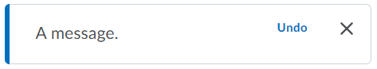

# Alerts

## d2l-alert

The `d2l-alert` component can be used to communicate important information relating to the state of the system and the user's work flow.



```html
<script type="module">
	import '@brightspace-ui/core/components/alert/alert.js';
</script>

<d2l-alert type="default" button-text="Undo" has-close-button>
	A message.
</d2l-alert>
```

**Properties:**

| Property | Type | Description |
|--|--|--|
| `button-text` | String | Text that is displayed within the alert's action button. If no text is provided the button is not displayed. |
| `has-close-button` | Boolean |  Gives the alert a close button that will close the alert when clicked |
| `hidden` | Boolean | Whether or not the alert is currently visible |
| `subtext` | String | The text that is displayed below the main alert message |
| `type` | String, default: `'default'` | Type of the alert being displayed. Can be one of  `default`, `critical`, `success`, `warning`. |

**Events:**
* `d2l-alert-close`: dispatched when the alert's close button is clicked
* `d2l-alert-button-press`: dispatched when the alert's action button is clicked

## d2l-alert-toast

The `d2l-alert-toast` component serves the same purpose as `d2l-alert`; however, it is displayed as
a pop-up at the bottom of the screen that automatically dismisses itself by default.

```html
<script type="module">
	import '@brightspace-ui/core/components/alert/alert-toast.js';
</script>

<d2l-alert-toast type="default">
	A default toast alert.
</d2l-alert-toast>
```

**Properties:**

- `button-text` (optional, String): text that is displayed within the alert's action button. If no text is provided the button is not displayed.
- `hide-close-button` (Boolean, default: `false`) hide the close button to prevent users from manually closing the alert.
- `no-auto-close` (Boolean, default: `false`) prevents the alert from automatically closing 4 seconds after opening.
- `no-padding` (Boolean): used to opt out of default padding/whitespace around the alert
- `open` (Boolean, default: `false`): open or close the toast alert.
- `subtext` (optional, String) The text that is displayed below the main alert message.
- `type` (String, default: `'default'`): type of the alert being displayed. Can be one of  `default`, `critical`, `success` , `warning`

**Events:**
* `d2l-alert-toast-close`: dispatched when the toast is closed

## Future Enhancements

Looking for an enhancement not listed here? Create a GitHub issue!
