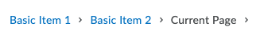

# Breadcrumbs

## d2l-breadcrumbs

The `d2l-breadcrumbs` element can be used to help users understand where they are within the LMS, and provide useful clues about how the space is organized. They also provide a convenient navigation mechanism.



```html
<script type="module">
  import '@brightspace-ui/core/components/breadcrumbs/breadcrumbs.js';
</script>

<d2l-breadcrumbs>
	<d2l-breadcrumb text="Item 1" href="#"></d2l-breadcrumb>
	<d2l-breadcrumb text="Item 2" href="#"></d2l-breadcrumb>
	<d2l-breadcrumb text="Item 3" href="#"></d2l-breadcrumb>
</d2l-breadcrumbs>
```

### Variants

#### Normal

```html
<script type="module">
  import '@brightspace-ui/core/components/breadcrumbs/breadcrumbs.js';
</script>

<d2l-breadcrumbs>
	<d2l-breadcrumb text="Item 1" href="#"></d2l-breadcrumb>
	<d2l-breadcrumb text="Item 2" href="#"></d2l-breadcrumb>
	<d2l-breadcrumb text="Item 3" href="#"></d2l-breadcrumb>
</d2l-breadcrumbs>
```


#### Limited Width

```html
<script type="module">
  import '@brightspace-ui/core/components/breadcrumbs/breadcrumbs.js';
</script>

<d2l-breadcrumbs style="max-width: 250px;">
	<d2l-breadcrumb href="#" text="Truncate Basic Item 1"></d2l-breadcrumb>
	<d2l-breadcrumb href="#" text="Truncate Basic Item 2"></d2l-breadcrumb>
	<d2l-breadcrumb href="#" text="Truncate Basic Item 3"></d2l-breadcrumb>
</d2l-breadcrumbs>
```

#### Compact

```html
<script type="module">
  import '@brightspace-ui/core/components/breadcrumbs/breadcrumbs.js';
</script>

<d2l-breadcrumbs compact>
	<d2l-breadcrumb href="#" text="Compact Item 1"></d2l-breadcrumb>
	<d2l-breadcrumb href="#" text="Compact Item 2"></d2l-breadcrumb>
	<d2l-breadcrumb href="#" text="Compact Item 3"></d2l-breadcrumb>
</d2l-breadcrumbs>
```

**d2l-breadcrumbs Properties:**

- `compact` (Boolean, default: `'false'`): indicates whether the component should render in compact mode


**d2l-breadcrumb (child) Properties:**

- `compact` (Boolean, default: `'false'`): indicates whether the child component should render in compact mode (automatically set by parent)
- `href` (String, default: `'#'`): Href of the breadcrumb item
- `target` (String, default: `'#'`): Target of the breadcrumb item
- `text` (String, default: `'#'`): Text of the breadcrumb item
- `aria-label` (String, default: `'#'`): AriaLabel of breadcrumb item

## Future Enhancements

Looking for an enhancement not listed here? Create a GitHub issue!