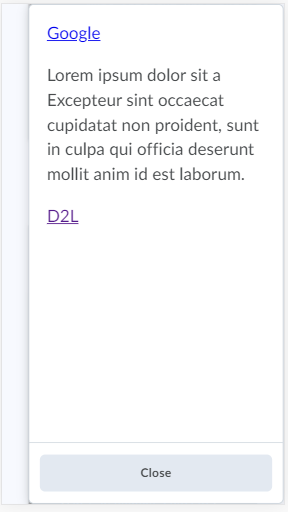

# Dropdowns
A Dropdown is a button that opens a floating container to offer menu items or other content.

## Opener: Dropdown [d2l-dropdown]

`d2l-dropdown` is a generic opener for dropdown content (`d2l-dropdown-content`, `d2l-dropdown-menu` or `d2l-dropdown-tabs`) enabling alternate opener implementation using existing elements/components. Provide and indicate your own opener element with the class attribute value `d2l-dropdown-opener`.  Wire-up is automatic.

<!-- docs: demo live name:d2l-dropdown autoSize:false align:flex-start size:medium -->
```html
<script type="module">
  import '@brightspace-ui/core/components/dropdown/dropdown.js';
  import '@brightspace-ui/core/components/dropdown/dropdown-content.js';
</script>
<script>
  window.addEventListener('load', function () {
    var dropdown = document.querySelector('d2l-dropdown');
    setTimeout(() => {
      dropdown.toggleOpen();
    }, 100);
  });
</script>
<d2l-dropdown>
  <button class="d2l-dropdown-opener">Open!</button>
  <d2l-dropdown-content>
    Some content...
  </d2l-dropdown-content>
</d2l-dropdown>
```

If the dropdown is initially empty when it's opened, the dropdown pointer will not be positioned correctly.  In such cases, the `no-auto-open` attribute may be added to the opener, enabling you to take control of when the dropdown is actually opened:

<!-- docs: start hidden content -->
### Properties

| Property | Type | Description |
|---|---|--|
| `disabled` | Boolean, default: `false` | Disables the dropdown opener |
| `no-auto-open` | Boolean, default: `false` | Prevents the dropdown from opening automatically on click or on key press |
<!-- docs: end hidden content -->

## Opener: Dropdown Button [d2l-dropdown-button]
`d2l-dropdown-button` is a `d2l-button` opener for dropdown content (`d2l-dropdown-content`, `d2l-dropdown-menu` or `d2l-dropdown-tabs`).

<!-- docs: start hidden content -->

<!-- docs: end hidden content -->

<!-- docs: demo live name:d2l-dropdown-button autoSize:false align:flex-start size:medium -->
```html
<script type="module">
  import '@brightspace-ui/core/components/dropdown/dropdown-button.js';
  import '@brightspace-ui/core/components/dropdown/dropdown-content.js';
</script>
<script>
  window.addEventListener('load', function () {
    var dropdown = document.querySelector('d2l-dropdown-button');
    setTimeout(() => {
      dropdown.toggleOpen();
    }, 100);
  });
</script>
<d2l-dropdown-button text="Open!">
  <d2l-dropdown-content>
    Some content...
  </d2l-dropdown-content>
</d2l-dropdown-button>
```

<!-- docs: start hidden content -->
### Properties

| Property | Type | Description |
|---|---|---|
| `text` | String, required | Text for the button |
| `disabled` | Boolean, default: `false` | Disables the dropdown opener |
| `no-auto-open` | Boolean, default: `false` | Prevents the dropdown from opening automatically on click or on key press |
| `primary` | Boolean, default: `false` | Optionally render button as primary button |
<!-- docs: end hidden content -->

## Opener: Button Subtle [d2l-dropdown-button-subtle]
`d2l-dropdown-button-subtle` is a `d2l-button-subtle` opener for dropdown content (`d2l-dropdown-content`, `d2l-dropdown-menu` or `d2l-dropdown-tabs`).

<!-- docs: start hidden content -->

<!-- docs: end hidden content -->

<!-- docs: demo live name:d2l-dropdown-button-subtle align:flex-start autoSize:false size:medium -->
```html
<script type="module">
  import '@brightspace-ui/core/components/dropdown/dropdown-button-subtle.js';
  import '@brightspace-ui/core/components/dropdown/dropdown-content.js';
</script>
<script>
  window.addEventListener('load', function () {
    var dropdown = document.querySelector('d2l-dropdown-button-subtle');
  setTimeout(() => {
    dropdown.toggleOpen();
  }, 100);
  });
</script>
<d2l-dropdown-button-subtle text="Open!">
  <d2l-dropdown-content>
    Some content...
  </d2l-dropdown-content>
</d2l-dropdown-button-subtle>
```

<!-- docs: start hidden content -->
### Properties

| Property | Type | Description |
|---|---|---|
| `text` | String, required | Text for the button |
| `description` | String | A description to be added to the inner `button` opener for accessibility |
| `disabled` | Boolean, default: `false` | Disables the dropdown opener |
| `no-auto-open` | Boolean, default: `false` | Prevents the dropdown from automatically on click or on key press |
<!-- docs: end hidden content -->

### Accessibility Properties

To make your `d2l-dropdown-button-subtle` accessible, use the following properties when applicable: 

| Attribute | Description |
|---|---|
| `description` | Use when text on button does not provide enough context. |

## Opener: Context Menu [d2l-dropdown-context-menu]
`d2l-dropdown-context-menu` is a simple/minimal opener for dropdown content (`d2l-dropdown-content`, `d2l-dropdown-menu` or `d2l-dropdown-tabs`).

<!-- docs: start hidden content -->

<!-- docs: end hidden content -->

<!-- docs: demo live name:d2l-dropdown-context-menu align:flex-start autoSize:false size:medium -->
```html
<script type="module">
  import '@brightspace-ui/core/components/dropdown/dropdown-context-menu.js';
  import '@brightspace-ui/core/components/dropdown/dropdown-content.js';
</script>
<script>
  window.addEventListener('load', function () {
    var dropdown = document.querySelector('d2l-dropdown-context-menu');
    setTimeout(() => {
      dropdown.toggleOpen();
    }, 100);
  });
</script>
<d2l-dropdown-context-menu text="Open!">
  <d2l-dropdown-content>
    Some content...
  </d2l-dropdown-content>
</d2l-dropdown-context-menu>
```

<!-- docs: start hidden content -->
### Properties

| Property | Type | Description |
|---|---|---|
| `disabled` | Boolean, default: `false` | Disables the dropdown opener |
| `no-auto-open` | Boolean, default: `false` | Prevents the dropdown from opening automatically on click or on key press |
| `text` | String | Used as `aria-label` for the button |
| `translucent` | Boolean, default: `false` | Attribute for busy/rich backgrounds |
| `visible-on-ancestor` | Boolean, default: `false` | See [visible-on-ancestor-mixin](../../mixins/visible-on-ancestor-mixin.md) for more details on configuring that behavior |
<!-- docs: end hidden content -->

### Accessibility Properties

To make your usage of `d2l-dropdown-context-menu` accessible, use the following property:

| Attribute | Description |
|---|---|
| `text` | Acts as a primary label and tooltip and is **REQUIRED**. |

## Opener: More [d2l-dropdown-more]
`d2l-dropdown-more` is a simple/minimal opener for dropdown content (`d2l-dropdown-content`, `d2l-dropdown-menu` or `d2l-dropdown-tabs`).

<!-- docs: start hidden content -->

<!-- docs: end hidden content -->

<!-- docs: demo live name:d2l-dropdown-more autoSize:false align:flex-start size:medium -->
```html
<script type="module">
  import '@brightspace-ui/core/components/dropdown/dropdown-more.js';
  import '@brightspace-ui/core/components/dropdown/dropdown-content.js';
</script>
<script>
  window.addEventListener('load', function () {
    var dropdown = document.querySelector('d2l-dropdown-more');
    setTimeout(() => {
      dropdown.toggleOpen();
    }, 100);
  });
</script>
<d2l-dropdown-more text="Open!">
  <d2l-dropdown-content>
    Some content...
  </d2l-dropdown-content>
</d2l-dropdown-more>
```

<!-- docs: start hidden content -->
### Properties

| Property | Type | Description |
|---|---|---|
| `disabled` | Boolean, default: `false` | Disables the dropdown opener |
| `no-auto-open` | Boolean, default: `false` | Prevents the dropdown from opening automatically on click or key press |
| `text` | String | Used as `aria-label` for the button |
| `translucent` | Boolean, default: `false` | Attribute for busy/rich backgrounds |
| `visible-on-ancestor` | Boolean, default: `false` | See [visible-on-ancestor-mixin](../../mixins/visible-on-ancestor-mixin.md) for more details on configuring that behavior |
<!-- docs: end hidden content -->

### Accessibility Properties

To make your usage of `d2l-dropdown-more` accessible, use the following property

| Attribute | Description |
|---|---|
| `text` | Acts as a primary label and tooltip and is **REQUIRED**. |

## Content: Container [d2l-dropdown-content]
`d2l-dropdown-content` is a generic container for dropdown content.  It provides behavior such as sizing,  positioning, and managing focus gain/loss.

<!-- docs: start hidden content -->


<!-- docs: end hidden content -->

<!-- docs: demo live name:d2l-dropdown-content autoSize:false align:flex-start size:medium -->
```html
<script type="module">
  import '@brightspace-ui/core/components/dropdown/dropdown-button.js';
  import '@brightspace-ui/core/components/dropdown/dropdown-content.js';
</script>
<script>
  window.addEventListener('load', function () {
    var dropdown = document.querySelector('d2l-dropdown-button');
    setTimeout(() => {
      dropdown.toggleOpen();
    }, 100);
  });
</script>
<d2l-dropdown-button text="Open!" primary>
  <d2l-dropdown-content min-width="150" max-width="400" mobile-tray="bottom">
    <p>Lorem ipsum dolor sit amet, consectetur adipiscing elit, sed do eiusmod tempor incididunt ut labore et dolore magna aliqua. Ut enim ad minim veniam, quis nostrud exercitation ullamco laboris nisi ut aliquip ex ea commodo consequat. Duis aute irure dolor in reprehenderit in voluptate velit esse cillum dolore eu fugiat nulla pariatur. Excepteur sint occaecat cupidatat non proident, sunt in culpa qui officia deserunt mollit anim id est laborum.</p>
  </d2l-dropdown-content>
</d2l-dropdown-button>
```
<!-- docs: start hidden content -->
### Properties

| Property | Type | Description |
|---|---|---|
| `align` | String | Optionally align dropdown to either `start` or `end`. If not set, the dropdown will attempt be centred |
| `boundary` | Object | Optionally provide boundaries to where the dropdown will appear. Valid properties are `"above"`, `"below"`, `"left"` and `"right"`. |
| `max-height` | Number | Override default `max-height`. _Note that the default behaviour is to be as tall as necessary within the viewport, so this property is usually not needed_ |
| `min-height` | Number | Override default height used for required space when `no-auto-fit` is true. Specify a number that would be the px value. _Note that the default behaviour is to be as tall as necessary within the viewport, so this property is usually not needed._ |
| `max-width` | Number | Override default `max-width` |
| `min-width` | Number | Override default `min-width` |
| `mobile-breakpoint` | Number, default: `616` | Override default breakpoint for mobile styling (616px) |
| `mobile-tray` | String, default: `no tray`| On small screens, optionally use a "tray" style dropdown. Valid options are `"left"`, `"right"`, and `"bottom"`. |
| `no-mobile-close-button` | Boolean, default: `false` | Opt out of automatically adding a 'close' button to the footer when using a mobile tray |
| `no-auto-close` | Boolean, default: `false` | Opt out of automatically closing on focus or click outside of the dropdown content |
| `no-auto-fit` | Boolean, default: `false` | Opt out of auto-sizing |
| `no-auto-focus` | Boolean, default: `false` | Opt out of focus being automatically moved to the first focusable element in the dropdown when opened |
| `no-padding` | Boolean, default: `false` | Render with no padding |
| `no-padding-header` | Boolean: default: `false` | Render the header with no padding (if it has content) |
| `no-padding-footer` | Boolean, default: `false` | Render the footer with no padding (if it has content) |
| `no-pointer` | Boolean, default: `false` | Render without a pointer |
| `trap-focus` | Boolean, default: `false` | Optionally render a d2l-focus-trap around the dropdown content |
| `vertical-offset` | Number or String | Provide custom offset, positive or negative |

### Events
| Name | Description |
|---|---|
| `d2l-dropdown-open` | Dispatched when the dropdown is opened |
| `d2l-dropdown-close` | dispatched when the dropdown is closed |
| `d2l-dropdown-position` | Dispatched when the dropdown position finishes adjusting |
| `d2l-dropdown-focus-enter` | dispatched when the 'trap-focus' attribute is applied and the focus-trap is entered (trap-focus option only) |

### Slots
| Name | Description |
|---|---|
| `header` | Sticky container at the top of the dropdown |
| `footer` | Sticky container at the bottom of the dropdown |
| `default` | Anything inside of `d2l-dropdown-content` that isn't in the `header` or `footer` slots appears as regular content |
<!-- docs: end hidden content -->

### Methods
* `async resize()`: Call if the size of the content changes due to a change in a nested component. The nested component may choose to fire a custom event, which the component containing the `d2l-dropdown-content` can catch and call this method. |

## Content: Menu [d2l-dropdown-menu]
`d2l-dropdown-menu` is a container for a [d2l-menu](../menu/README.md) component. It provides additional support on top of `d2l-dropdown-content` for closing the menu when menu items are selected, resetting to the root of nested menus when reopening and automatic resizing when the menu resizes.

<!-- docs: start hidden content -->

<!-- docs: end hidden content -->

<!-- docs: demo live name:d2l-dropdown-menu size:medium autoSize:false -->
```html
<script type="module">
  import '@brightspace-ui/core/components/dropdown/dropdown-button.js';
  import '@brightspace-ui/core/components/dropdown/dropdown-menu.js';
</script>
<script>
  window.addEventListener('load', function () {
    var dropdown = document.querySelector('d2l-dropdown-button');
    setTimeout(() => {
      dropdown.toggleOpen();
    }, 100);
  });
</script>
<d2l-dropdown-button text="Open!" primary>
  <d2l-dropdown-menu id="dropdown">
    <d2l-menu label="Astronomy">
      <d2l-menu-item text="Introduction"></d2l-menu-item>
      <d2l-menu-item text="Searching for the Heavens "></d2l-menu-item>
      <d2l-menu-item text="The Solar System">
        <d2l-menu>
          <d2l-menu-item text="Formation"></d2l-menu-item>
          <d2l-menu-item text="Modern Solar System"></d2l-menu-item>
          <d2l-menu-item text="Future Solar System"></d2l-menu-item>
          <d2l-menu-item text="The Planets"></d2l-menu-item>
          <d2l-menu-item text="The Sun"></d2l-menu-item>
          <d2l-menu-item text="Solar &amp; Lunar Eclipses"></d2l-menu-item>
          <d2l-menu-item text="Meteors &amp; Meteorites"></d2l-menu-item>
          <d2l-menu-item text="Asteroids"></d2l-menu-item>
          <d2l-menu-item text="Comets"></d2l-menu-item>
        </d2l-menu>
      </d2l-menu-item>
      <d2l-menu-item text="Stars &amp; Galaxies"></d2l-menu-item>
      <d2l-menu-item text="The Night Sky"></d2l-menu-item>
      <d2l-menu-item text="The Universe"></d2l-menu-item>
    </d2l-menu>
  </d2l-dropdown-menu>
</d2l-dropdown-button>
```

## Content: Tabs [d2l-dropdown-tabs]
`d2l-dropdown-tabs` is a container for a [d2l-tabs](https://github.com/BrightspaceUI/tabs) component. It provides additional support on top of `d2l-dropdown-content` for automatic resizing when the tab changes.

<!-- docs: start hidden content -->

<!-- docs: end hidden content -->

<!-- docs: demo live name:d2l-dropdown-tabs size:medium autoSize:false -->
```html
<script type="module">
  import '@brightspace-ui/core/components/dropdown/dropdown-button.js';
  import '@brightspace-ui/core/components/dropdown/dropdown-tabs.js';
</script>
<script>
  window.addEventListener('load', function () {
    var dropdown = document.querySelector('d2l-dropdown-button');
    setTimeout(() => {
      dropdown.toggleOpen();
    }, 100);
  });
</script>
<d2l-dropdown-button text="Open!" primary>
  <d2l-dropdown-tabs min-width="175" max-width="300">
    <d2l-tabs>
      <d2l-tab-panel text="first">first content</d2l-tab-panel>
      <d2l-tab-panel text="second">
        <p>Lorem ipsum dolor sit amet, consectetur adipiscing elit, sed do eiusmod tempor incididunt ut labore et dolore magna aliqua.</p>
      </d2l-tab-panel>
      <d2l-tab-panel text="third">
        <d2l-menu label="Astronomy">
          <d2l-menu-item text="Searching for the Heavens "></d2l-menu-item>
          <d2l-menu-item text="The Universe"></d2l-menu-item>
        </d2l-menu>
      </d2l-tab-panel>
      <d2l-tab-panel text="fourth">fourth content</d2l-tab-panel>
      <d2l-tab-panel text="fifth">fifth content</d2l-tab-panel>
      <d2l-tab-panel text="sixth">sixth content</d2l-tab-panel>
    </d2l-tabs>
  </d2l-dropdown-tabs>
</d2l-dropdown>
```

<!-- docs: start hidden content -->
## Future Enhancements

Looking for an enhancement not listed here? Create a GitHub issue!
<!-- docs: end hidden content -->
