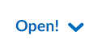
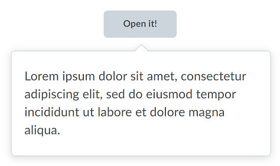
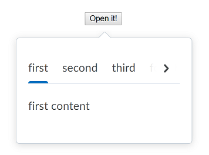

# Dropdowns
## Dropdown Openers

### d2l-dropdown

`d2l-dropdown` is a generic opener for dropdown content (`d2l-dropdown-content`, `d2l-dropdown-menu` or `d2l-dropdown-tabs`) enabling alternate opener implementation using existing elements/components. Provide and indicate your own opener element with the class attribute value `d2l-dropdown-opener`.  Wire-up is automatic.

```html
<script type="module">
  import '@brightspace-ui/core/components/dropdown/dropdown.js';
  import '@brightspace-ui/core/components/dropdown/dropdown-content.js';
</script>

<d2l-dropdown>
  <button class="d2l-dropdown-opener">Open!</button>
  <d2l-dropdown-content>
    Some content...
  </d2l-dropdown-content>
</d2l-dropdown>
```

If the dropdown is initially empty when it's opened, the dropdown pointer will not be positioned correctly.  In such cases, the `no-auto-open` attribute may be added to the opener, enabling you to take control of when the dropdown is actually opened:

```html
<d2l-dropdown no-auto-open>
  ...
</d2l-dropdown>
```

```javascript
dropdown.addEventListener('click', function() {
  // fetch some content
  ...
  // take control of when the dropdown is actually opened
  dropdown.toggleOpen();
});
```

**Properties:**
- `disabled` (Boolean, default: `false`): disables the dropdown opener
- `no-auto-open` (Boolean, default: `false`): prevents the dropdown from opening automatically on or on key press

### d2l-dropdown-button
`d2l-dropdown-button` is a `d2l-button` opener for dropdown content (`d2l-dropdown-content`, `d2l-dropdown-menu` or `d2l-dropdown-tabs`).


```html
<script type="module">
  import '@brightspace-ui/core/components/dropdown/dropdown-button.js';
  import '@brightspace-ui/core/components/dropdown/dropdown-content.js';
</script>

<d2l-dropdown-button text="Open!">
  <d2l-dropdown-content>
    Some content...
  </d2l-dropdown-content>
</d2l-dropdown-button>
```

**Properties:**
- `text` (required, String): text for the button
- `disabled` (Boolean, default: `false`): disables the dropdown opener
- `no-auto-open` (Boolean, default: `false`): prevents the dropdown from opening automatically on or on key press
- `primary` (Boolean, default: `false`): optionally render button as primary button

### d2l-dropdown-button-subtle
`d2l-dropdown-button-subtle` is a `d2l-button-subtle` opener for dropdown content (`d2l-dropdown-content`, `d2l-dropdown-menu` or `d2l-dropdown-tabs`).



```html
<script type="module">
  import '@brightspace-ui/core/components/dropdown/dropdown-button-subtle.js';
  import '@brightspace-ui/core/components/dropdown/dropdown-content.js';
</script>

<d2l-dropdown-button-subtle text="Open!">
  <d2l-dropdown-content>
    Some content...
  </d2l-dropdown-content>
</d2l-dropdown-button-subtle>
```

**Properties:**
- `text` (required, String): text for the button
- `disabled` (Boolean, default: `false`): disables the dropdown opener
- `no-auto-open` (Boolean, default: `false`): prevents the dropdown from opening automatically on or on key press

### d2l-dropdown-context-menu
`d2l-dropdown-context-menu` is a simple/minimal opener for dropdown content (`d2l-dropdown-content`, `d2l-dropdown-menu` or `d2l-dropdown-tabs`).


```html
<script type="module">
  import '@brightspace-ui/core/components/dropdown/dropdown-context-menu.js';
  import '@brightspace-ui/core/components/dropdown/dropdown-content.js';
</script>

<d2l-dropdown-context-menu text="Open!">
  <d2l-dropdown-content>
    Some content...
  </d2l-dropdown-content>
</d2l-dropdown-context-menu>
```

**Properties:**
- `disabled` (Boolean, default: `false`): disables the dropdown opener
- `no-auto-open` (Boolean, default: `false`): prevents the dropdown from opening automatically on or on key press
- `text` (String): ARIA label for the button
- `translucent` (Boolean, default: `false`): attribute for busy/rich backgrounds
- `visible-on-ancestor` (Boolean, default: `false`): See [visible-on-ancestor-mixin](../../mixins/visible-on-ancestor-mixin.md) for more details on configuring that behavior.

**Accessibility:**

To make your usage of `d2l-dropdown-context-menu` accessible, use the following property:

| Attribute | Description |
|--|--|
| `text` | Acts as a primary label and tooltip and is **REQUIRED**. |

### d2l-dropdown-more
`d2l-dropdown-more` is a simple/minimal opener for dropdown content (`d2l-dropdown-content`, `d2l-dropdown-menu` or `d2l-dropdown-tabs`).


```html
<script type="module">
  import '@brightspace-ui/core/components/dropdown/dropdown-more.js';
  import '@brightspace-ui/core/components/dropdown/dropdown-content.js';
</script>

<d2l-dropdown-more text="Open!">
  <d2l-dropdown-content>
    Some content...
  </d2l-dropdown-content>
</d2l-dropdown-more>
```

**Properties:**
- `disabled` (Boolean, default: `false`): disables the dropdown opener
- `no-auto-open` (Boolean, default: `false`): prevents the dropdown from opening automatically on or on key press
- `text` (String): ARIA label for the button
- `translucent` (Boolean, default: `false`): attribute for busy/rich backgrounds
- `visible-on-ancestor` (Boolean, default: `false`): See [visible-on-ancestor-mixin](../../mixins/visible-on-ancestor-mixin.md) for more details on configuring that behavior.

**Accessibility:**

To make your usage of `d2l-dropdown-more` accessible, use the following property:

| Attribute | Description |
|--|--|
| `text` | Acts as a primary label and tooltip and is **REQUIRED**. |

## Dropdown Contents

### d2l-dropdown-content

`d2l-dropdown-content` is a generic container for dropdown content.  It provides behavior such as sizing,  positioning, and managing focus gain/loss.



```html
<script type="module">
  import '@brightspace-ui/core/components/dropdown/dropdown-button.js';
  import '@brightspace-ui/core/components/dropdown/dropdown-content.js';
</script>

<d2l-dropdown-button text="Open!" primary>
  <d2l-dropdown-content min-width="150" max-width="400">
    <a href="https://www.google.com">Google</a>
    <p>Lorem ipsum dolor sit amet, consectetur adipiscing elit, sed do eiusmod tempor incididunt ut labore et dolore magna aliqua. Ut enim ad minim veniam, quis nostrud exercitation ullamco laboris nisi ut aliquip ex ea commodo consequat. Duis aute irure dolor in reprehenderit in voluptate velit esse cillum dolore eu fugiat nulla pariatur. Excepteur sint occaecat cupidatat non proident, sunt in culpa qui officia deserunt mollit anim id est laborum.</p>
    <a href="http://www.desire2learn.com">D2L</a>
  </d2l-dropdown-content>
</d2l-dropdown-button>
```

**Properties:**
* `min-width` (Number): override default min-width
* `max-width` (Number): override default max-width
* `max-height` (Number): override max-height. _Note that the default behaviour is to be as tall as necessary within the viewport, so this property is usually not needed_
* `no-auto-close` (Boolean, default: `false`): opt out of automatically closing on focus or click outside of the dropdown content
* `no-auto-fit` (Boolean, default: `false`): opt out of auto-sizing
* `no-auto-focus` (Boolean, default: `false`): opt out of focus being automatically moved to the first focusable element in the dropdown when opened
* `no-padding` (Boolean, default: `false`): render with no padding
* `no-padding-header` (Boolean, default: `false`): render the header with no padding (if it has content)
* `no-padding-footer` (Boolean, default: `false`): render the footer with no padding (if it has content)
* `no-pointer` (Boolean, default: `false`): render without a pointer
* `vertical-offset` (Number|String) - provide custom offset, positive or negative
* `align` (String): optionally align dropdown to either `start` or `end`. If not set, the dropdown will attempt be centred
* `boundary` (Object) - optionally provide boundaries to where the dropdown will appear. Valid properties are `"above"`, `"below"`, `"left"` and `"right"`.

**Events:**
* `d2l-dropdown-open`: dispatched when the dropdown is opened
* `d2l-dropdown-close`: dispatched when the dropdown is closed

**Slots:**
* `header`: Sticky container at the top of the dropdown
* `footer`: Sticky container at the bottom of the dropdown
* `default`: Anything inside of `d2l-dropdown-content` that isn't in the `header` or `footer` slots appears as regular content

```html
<d2l-dropdown-content min-width="150" max-width="400">
  <div slot="header">Header Content</div>
  Some Content...
  <div slot="footer">Footer Content</div>
</d2l-dropdown-content>
```

### d2l-dropdown-menu
`d2l-dropdown-menu` is a container for a [d2l-menu](../menu/README.md) component. It provides additional support on top of `d2l-dropdown-content` for closing the menu when menu items are selected, resetting to the root of nested menus when reopening and automatic resizing when the menu resizes.


```html
<script type="module">
  import '@brightspace-ui/core/components/dropdown/dropdown-button.js';
  import '@brightspace-ui/core/components/dropdown/dropdown-menu.js';
</script>

<d2l-dropdown-button text="Open!" primary>
  <d2l-dropdown-menu id="dropdown">
    <d2l-menu label="Astronomy">
      <d2l-menu-item text="Introduction"></d2l-menu-item>
      <d2l-menu-item text="Searching for the Heavens "></d2l-menu-item>
      <d2l-menu-item text="The Solar System">
        <d2l-menu>
          <d2l-menu-item text="Formation"></d2l-menu-item>
          <d2l-menu-item text="Modern Solar System"></d2l-menu-item>
          <d2l-menu-item text="Future Solar System"></d2l-menu-item>
          <d2l-menu-item text="The Planets"></d2l-menu-item>
          <d2l-menu-item text="The Sun"></d2l-menu-item>
          <d2l-menu-item text="Solar &amp; Lunar Eclipses"></d2l-menu-item>
          <d2l-menu-item text="Meteors &amp; Meteorites"></d2l-menu-item>
          <d2l-menu-item text="Asteroids"></d2l-menu-item>
          <d2l-menu-item text="Comets"></d2l-menu-item>
        </d2l-menu>
      </d2l-menu-item>
      <d2l-menu-item text="Stars &amp; Galaxies"></d2l-menu-item>
      <d2l-menu-item text="The Night Sky"></d2l-menu-item>
      <d2l-menu-item text="The Universe"></d2l-menu-item>
    </d2l-menu>
  </d2l-dropdown-menu>
</d2l-dropdown-button>
```

### d2l-dropdown-tabs
`d2l-dropdown-tabs` is a container for a [d2l-tabs](https://github.com/BrightspaceUI/tabs) component. It provides additional support on top of `d2l-dropdown-content` for automatic resizing when the tab changes.



```html
<script type="module">
  import '@brightspace-ui/core/components/dropdown/dropdown-button.js';
  import '@brightspace-ui/core/components/dropdown/dropdown-tabs.js';
</script>

<d2l-dropdown-button text="Open!" primary>
  <d2l-dropdown-tabs min-width="175" max-width="300">
    <d2l-tabs>
      <d2l-tab-panel text="first">first content</d2l-tab-panel>
      <d2l-tab-panel text="second">
        <p>Lorem ipsum dolor sit amet, consectetur adipiscing elit, sed do eiusmod tempor incididunt ut labore et dolore magna aliqua.</p>
      </d2l-tab-panel>
      <d2l-tab-panel text="third">
        <d2l-menu label="Astronomy">
          <d2l-menu-item text="Searching for the Heavens "></d2l-menu-item>
          <d2l-menu-item text="The Universe"></d2l-menu-item>
        </d2l-menu>
      </d2l-tab-panel>
      <d2l-tab-panel text="fourth">fourth content</d2l-tab-panel>
      <d2l-tab-panel text="fith">fith content</d2l-tab-panel>
      <d2l-tab-panel text="sixth">sixth content</d2l-tab-panel>
    </d2l-tabs>
  </d2l-dropdown-tabs>
</d2l-dropdown>
```

## Future Enhancements

Looking for an enhancement not listed here? Create a GitHub issue!
