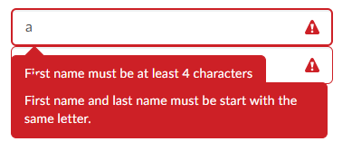
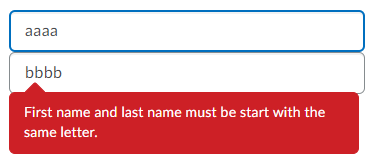

# FormElementMixin

## Nesting Custom Form Elements

In some cases you may find yourself wanting to create a custom form element using the [`FormElementMixin`](./form-element-mixin.md) that uses other existing custom form elements internally. An example of this would be a name input component that has two internal `d2l-input-text` components; one for the first name and one for the last name.

###  What is different about nesting custom form elements?

Because custom form elements support validation and form submission, we need to make sure nested custom form elements are connected properly. Scenarios that need to be handled include:
- Validating the parent correctly causes its nested custom form elements to be validated
- Setting `novalidate` on the parent correctly sets `novalidate` on its nested custom form elements
- The parent form element hides its validation tooltip if it causes overlap with a nested custom form element's tooltip
- The form submission value for the parent correctly includes all nested custom form elements' submission values

### Implementing our custom form element

**Properties:**
| Property | Type | Description |
|--|--|--|
| `childErrors` | read-only, Map<FormElementMixin(HTMLElement), String[]> | A map containing all nested form elements with visible validation errors and the list of errors associated with them.<br><br>This can be used to hide validation errors in the parent component if they would cause conflicts with nested custom form elements. |
| `force-invalid` | Boolean, default: `false` | Force invalid can be used on nested custom form elements to force them to be styled as invalid if their parent is invalid.|
| `novalidate` | Boolean, default: `false` | This must be passed up to nested custom form elements to ensure they won't get validated if the parent has validation disabled.  |

**Methods:**
- `async validate()`: Validate must be overridden and modified to call `validate` for all nested custom form elements and return the aggregated list of errors. This ensures that validating the parent will validate all nested components.
	- **Note:** It is important that the aggregated errors are returned with nested validation errors ordered first with parent validation errors last.

**1. Create a basic custom form element:**

First we can start by defining a custom form element based on the basic [`FormElementMixin`](./form-element-mixin.md) documentation. This custom form element contains two internal `d2l-input-text` custom form elements.

```javascript
import { FormElementMixin } from '@brightspace-ui/core/form/form-element-mixin.js';

// Use the FormElementMixin
class MyNestingFormElement extends FormElementMixin(LitElement) {

	static get properties() {
		return {
			_firstName: { type: String },
			_lastName: { type: String }
		};
	}

	firstUpdated(changedProperties) {
		super.firstUpdated(changedProperties);
		this._onBlur = this._onBlur.bind(this);
		this.addEventListener('blur', this._onBlur);
	}

	render() {
		// Conditionally render our validation error message if there is one
		const tooltip = this.validationError
			? html`<d2l-tooltip align="start" state="error">${this.validationError}</d2l-tooltip>`
			: null;
		return html`
			<d2l-input-text label="First Name" @input=${this._onFirstNameInput} id="first-name"></d2l-input-text>
			<d2l-input-text label="Last Name" @input=${this._onLastNameInput} id="last-name"></d2l-input-text>
			${tooltip}
		`;
	}

	updated(changedProperties) {
		super.updated(changedProperties);
		if (changedProperties.has('_firstName') || changedProperties.has('_lastName')) {
			// Setting the form value each time either value changes
			// Note: Each key is prefixed with this.name to avoid collisions if this control is used multiple times in a single form
			this.setFormValue({
				[`${this.name}-firstName`]: this._firstName,
				[`${this.name}-lastName`]: this._lastName,
			});
			// Since the user is in the middle of editing, false is passed because we only want to update the existing error message
			this.requestValidate(false);
		}
	}

	_onBlur() {
		// true is passed because we only want to show new errors when the user has finished editing
		this.requestValidate(true);
	}

	_onFirstNameInput(e) {
		this._firstName = e.target.value;
	}

	_onLastNameInput(e) {
		this._lastName = e.target.value;
	}
}
customElements.define('my-nesting-form-element', MyNestingFormElement);
```

**2. Use the text-input's form validation:**

We will use `d2l-input-text`'s `minlength` validation attribute to validate our values.

```javascript
render() {
	const tooltip = this.validationError
		? html`<d2l-tooltip align="start" state="error">${this.validationError}</d2l-tooltip>`
		: null;
	// Add minlength of 4 to each
	return html`
		<d2l-input-text minlength="4" label="First Name" @input=${this._onFirstNameInput} id="first-name"></d2l-input-text>
		<d2l-input-text minlength="4" label="Last Name" @input=${this._onLastNameInput} id="last-name"></d2l-input-text>
		${tooltip}
	`;
}
```

**3. Add validation logic to our parent custom form element:**

We will add a requirement that both the first and last name must start with the same letter using `setValidity()`.

```javascript
updated(changedProperties) {
	super.updated(changedProperties);
	if (changedProperties.has('_firstName') || changedProperties.has('_lastName')) {
		this.setFormValue({
			[`${this.name}-firstName`]: this._firstName,
			[`${this.name}-lastName`]: this._lastName,
		});
		// Set the badInput flag if they don't start with the same character.
		this.setValidity({
			badInput: this._firstName && this._lastName && this._firstName[0] !== this._lastName[0]
		});
		this.requestValidate(false);
	}
}
```

**4. Add a custom validation message for our bad input error:**

To ensure that users have the ability to fix our custom validation error, we will add an accompanying custom validation message.

```javascript
get validationMessage() {
	if (this.validity.badInput) {
		return 'First name and last name must be start with the same letter.';
	}
	// Don't forget to call super.validationMessage to provide a default error message.
	return super.validationMessage;
}
```

**5. Prevent tooltip overlap:**



Now that we have our validation logic for our parent and nested custom form elements, we need to make sure their validation tooltips don't overlap. To do this we will hide the tooltip using the `childErrors` `Map` which will tell us if any of the nested form elements are currently displaying validation errors.

```javascript
render() {
	// Only show the tooltip if there are no childErrors
	const tooltip = this.validationError && this.childErrors.size === 0
		? html`<d2l-tooltip align="start" state="error">${this.validationError}</d2l-tooltip>`
		: null;
	return html`
		<d2l-input-text minlength="4" label="First Name" @input=${this._onFirstNameInput} id="first-name"></d2l-input-text>
		<d2l-input-text minlength="4" label="Last Name" @input=${this._onLastNameInput} id="last-name"></d2l-input-text>
		${tooltip}
	`;
}
```

**6: Adding invalid styling for the nested custom form elements:**



Now that the tooltips no longer overlap, we want to ensure the nested `input-text` elements look invalid even if only the parent is actually invalid. To do this, we will use the `forceInvalid` property to force the nested elements to look invalid when the parent is invalid.

```javascript
render() {
	const tooltip = this.validationError && this.childErrors.size === 0
		? html`<d2l-tooltip align="start" state="error">${this.validationError}</d2l-tooltip>`
		: null;
	// Set forceInvalid for both nested form elements
	return html`
		<d2l-input-text .forceInvalid=${this.invalid} label="First Name" minlength="4" @input=${this._onFirstNameInput} id="first-name"></d2l-input-text>
		<d2l-input-text .forceInvalid=${this.invalid} label="Last Name" minlength="4" @input=${this._onLastNameInput} id="last-name"></d2l-input-text>
		${tooltip}
	`;
}
```

**7. Support novalidate:**

Custom form elements allow validation to be disabled. To support this, we need to pass `noValidate` up the nested custom form elements.

```javascript
render() {
	const tooltip = this.validationError && this.childErrors.size === 0
		? html`<d2l-tooltip align="start" state="error">${this.validationError}</d2l-tooltip>`
		: null;
	// Pass up novalidate to nested elements
	return html`
		<d2l-input-text ?novalidate=${this.noValidate} .forceInvalid=${this.invalid} label="First Name" minlength="4" @input=${this._onFirstNameInput} id="first-name"></d2l-input-text>
		<d2l-input-text ?novalidate=${this.noValidate} .forceInvalid=${this.invalid} label="Last Name" minlength="4" @input=${this._onLastNameInput} id="last-name"></d2l-input-text>
		${tooltip}
	`;
}
```

**8. Support Validate:**

The last step is to ensure that calling validate on the parent will result in the nested components being validated. This is not required for self-validation but is important to ensure your custom form element works properly when used inside a [`d2l-form`](../form.md) or [`d2l-form-native`](../form-native.md).

```javascript
async validate() {
	const firstNameInput = this.shadowRoot.querySelector('#first-name');
	const lastNameInput = this.shadowRoot.querySelector('#last-name');
	const errors = await Promise.all([firstNameInput.validate(), lastNameInput.validate(), super.validate()]);
	// It is important that the errors are ordered with nested form elements first and the parent component last
	return [...errors[0], ...errors[1], ...errors[2]];
}
```

## Future Enhancements

Looking for an enhancement not listed here? Create a GitHub issue!
