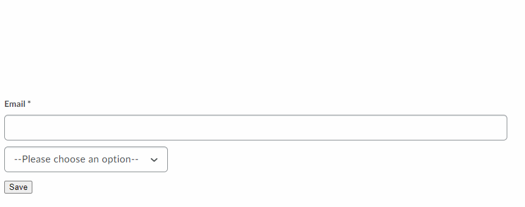

# Forms

## d2l-form-native

The `d2l-form-native` component can be used to build sections containing interactive controls that are validated and submitted as a group.

It differs from the native HTML `form` element in 2 ways:
1. It supports custom form elements made using the [`FormElementMixin`](./form-element-mixin.md) in addition to native form elements like `input`, `select` and `textarea`.
1. Upon validation, it will display an error summary that contains error messages for any elements that failed validation.



```html
<script type="module">
  import '@brightspace-ui/core/components/form/d2l-form-native.js';
</script>
<d2l-form-native>
  <d2l-input-text required label="Email" name="email" type="email"></d2l-input-text>
  <select class="d2l-input-select" name="pets" required>
    <option value="">--Please choose an option--</option>
    <option value="porpoise">Porpoise</option>
    <option value="house hippo">House Hippo</option>
    <option value="spiker monkey">Spider Monkey</option>
    <option value="capybara">Capybara</option>
  </select>
  <button name="action" value="save" type="submit" @click=${e => {
      this.shadowRoot.querySelector('d2l-form-native').requestSubmit(e.target);
    }}>Save
  </button>
</d2l-form-native>
```

**Properties:**

| Property | Type | Description |
|--|--|--|
| `action` | String | The URL that processes the form submission. |
| `enctype` | default: `"application/x-www-form-urlencoded"`<br>`"multipart/form-data"`<br>`"text/plain"` | If the value of the method attribute is post, enctype is the MIME type of the form submission. |
| `method` | default: `"get"`<br>`"post"` | The URL that processes the form submission. |
| `target` | default: `"_self"`<br>`"_blank"`<br>`"_parent"`<br>`"_top"` | Indicates where to display the response after submitting the form. |
| `track-changes` | Boolean, default: `false` | Indicates that the form should interrupt and warn on navigation if the user has unsaved changes. |

**Methods:**
- `submit()`: Submits the form to the server. This will first perform validation on all elements within the form. Submission will only happen if validation succeeds.
- `requestSubmit(submitter)`: Requests that the form be submitted using the specified submit button and its corresponding configuration. A `button`'s value is only submitted if that button is both part of the form and the `submitter`.
- `async validate()`: Validates the form without submitting even if validation succeeds. This returns a `Map` mapping from an element to the list of error messages associated with it.

**Events:**
- `submit`: Dispatched when the form is submitted. Cancelling this event will prevent form submission.
- `formdata`: Dispatched after the entry list representing the form's data is constructed. This happens when the form is submitted just prior to submission. The form data can be obtained from the `detail`'s `formData` property.

## Future Enhancements

Looking for an enhancement not listed here? Create a GitHub issue!
