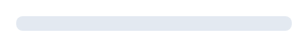
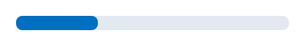
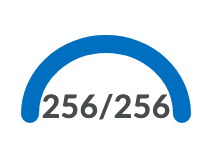

# Meter Components

* Note this is considered as progress indicator in design.

## d2l-meter-linear




### Usage

Import
```js
import '/@brightspace-ui/core/components/meter/meter-linear.js';
```

Then add the `d2l-meter-linear`, provide values for the properties, `value` and `max`.

```html
<d2l-meter-linear value="30" max="100"></d2l-meter-linear>
```

***Properties:***

* `value` (required): The current number of units that have been marked as completed. Should be a positive, non-zero number that is less than or equal to `max`
* `max` (required): Max number of units that is being measured by this meter. For results this should be a positive, non-zero number

## d2l-meter-radial




### Usage

Import
```js
import '/@brightspace-ui/core/components/meter/meter-radial.js';
```

Then add the `d2l-meter-radial`, provide values for the properties, `value` and `max`.

```html
<d2l-meter-radial value="30" max="100"></d2l-meter-radial>
```

***Properties:***

* `value` (required): The current number of units that have been marked as completed. Should be a positive, non-zero number that is less than or equal to `max`
* `max` (required): Max number of units that is being measured by this meter. For results this should be a positive, non-zero number
