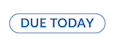

# Status Indicator

## d2l-status-indicator

The `d2l-status-indicator` element can be used to communicate the status of an item. It is non-interactive and used to assert prominence on state.



```html
<script type="module">
  import '@brightspace-ui/core/components/status-indicator/status-indicator.js';
</script>

<d2l-status-indicator state="default" text="Due Today"></d2l-status-indicator>
```

**Properties:**

- `state` (String, default: `'default'`): State of status indicator to display. Can be one of  `default`, `success`, `alert` , `none`
- `text` (required, String): The text that is displayed within the status indicator
